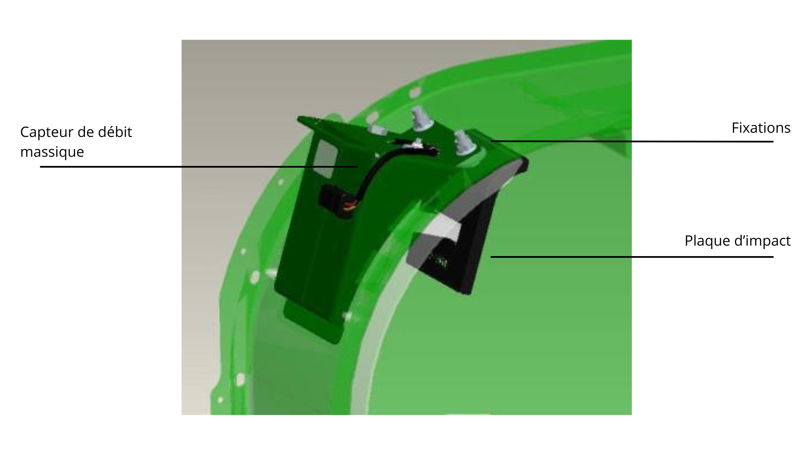
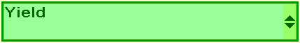
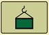

# Calibrage du rendement

<figure>
  
  <figcaption>Système de contrôle du rendement</figcaption>
</figure>

>Note : Les charges de calibrage doivent être de taille uniforme et d'un
>minimum de 1360,777 kg. Il est possible de sauvegarder un maximum de 13 charges de
>calibrage pour chaque type de récolte. Pour des résultats plus précis, utilisez deux charges de calibrage :
>   1. Récoltez la première charge de calibrage à la même vitesse que celle de déplacement habituelle lors de la récolte
>   1. Récoltez la deuxième charge de calibrage à la moitié de la vitesse de déplacement utilisée pour la première charge.

> Note : Le calibrage doit être effectué plusieurs fois et à différentes vitesses de déplacement.
  
1. Assurez-vous que le logiciel **AYM AXE66411A** ou une version plus récente est
installé sur le capteur d'humidité.
1. Assurez-vous que la trémie soit vide et que le capteur de débit massique soit propre.
1. Sur page d'accueil de la console, appuyez sur **B**. 
1. Appuyez sur **G**. 
1. Sélectionnez **Rendement** dans la liste des calibrages. 

1. Appuyez sur **Accepter**.  Depuis cet écran, si aucun calibrage n'est 
en cours, vous pouvez : 
    1. Gérer les charges de calibrage existantes ;
    2. Démarrer une nouvelle charge de calibrage ; 
    3. Annuler la procédure de calibrage.

1. Appuyez sur **Suivant** pour débuter le calibrage.
1. Commencez la récolte. 
    > Note : La quantité récoltée doit être d'au moins 1360,777 kg.
1. Une fois le minimum atteint, déchargez et notez le poids réel pesé.
1. Appuyez sur **Suivant**. 
1. Saisissez le poids précis mesuré par la balance dans la case **Réel**. 
1. Appuyez sur le bouton **Retour** pour revenir à la page **Calibrage du rendement**. 
1. Appuyez sur **Suivant**. 
1. Retournez à l'écran **Gestion du calibrage**. 
1. Cochez les cases des numéros de charge lorsque la valeur **%**
est compris entre -3,0 et 3,0.
1. Appuyez sur **Calibrage**. 
1. Une fois la mise à jour du calibrage terminée, appuyez sur **Accepter**. 

> Note : Pour supprimer des charges de calibrage, appuyez sur **Supprimer** à côté de la charge correspondante. Cette action est irréversible. 

