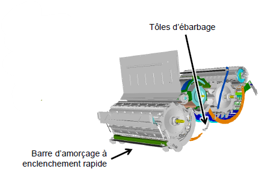
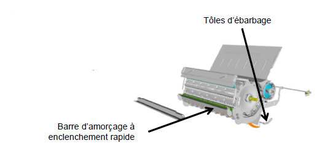
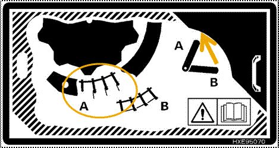
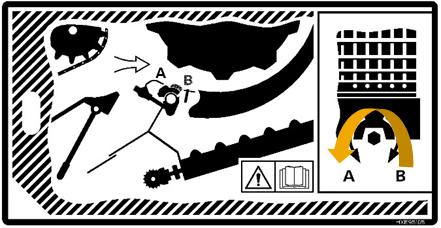

# Battage

||Série T|Série W|
| :--------------- |:---------------:| :-----:|
|Plaque d'obturation de la trape à pierre|Non|Non|
|Barre d'amorçage|Si nécessaire|Si nécessaire |
|Contre-batteur|Court/mixte| Céréales à petits grains/mixte |
|Plaques d'obturation du batteur|Non|Non|
|Tôles d'ébarbage|Si nécessaire|Si nécessaire|
|Plage de régime du batteur|Haut s'il est équipé d'un entraînement de battteur à deux vitesses|Haut s'il est équipé d'un entraînement de battteur à deux vitesses|
|Régime du batteur (tr/min)|750-950|750-950|
|Ecartement du contre-batteur (mm)|2-12|2-12|
|Dessin du batteur|||

