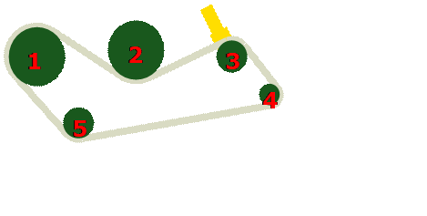

# Configuration et changement de rapport de la trémie à grain

||1|2|3|4|5|Chaîne|
|:--|:--|:--|:--|:--|:--|:--|
|RUR* Standard|AH125070 49T|AH125070 49T|AH206131 24T|HXE33324 20T|HXE76913 46T|AXE55765 maillons ¾po x 198|
|Ultra-rapide* Standard|HXE63642 45T|HXE63642 45T|AXE27959 19T|HXE95326 21T|HXE63575 31T|AXE37810 maillons 1po x 156|
|RUR graminées|AH140001 60T |AH140001 60T |AH206131 24T|HXE33324 20T|HXE100784 34T|AXE56875 maillons ¾po x 204|
|RUR riz/maïs|AH140001 60T|AH140001 60T|AH206131 24T|AH128074 17T|HXE100785 40T|AXE56875 maillons ¾po x 204|
|Ultra-rapide graminées/riz/maïs|HXE73865 54T|HXE73865 54T|HXE43629 19T|HXE64040 19T|HXE63575 31T|AXE57022 maillons1pox 162|

*RUR : Vitesse de déchargement normale : 88 l/s
*Ultra-rapide : Vitesse de déchargement normale : 125 l/s