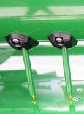
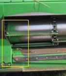
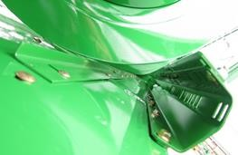
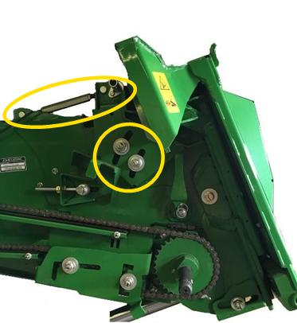
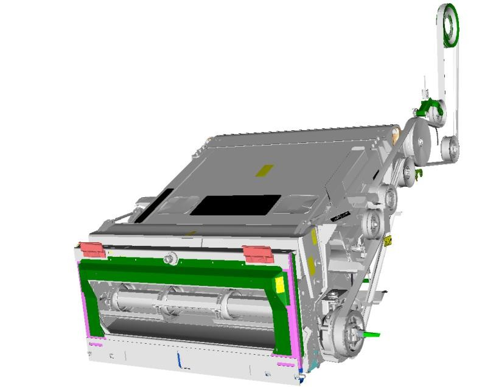
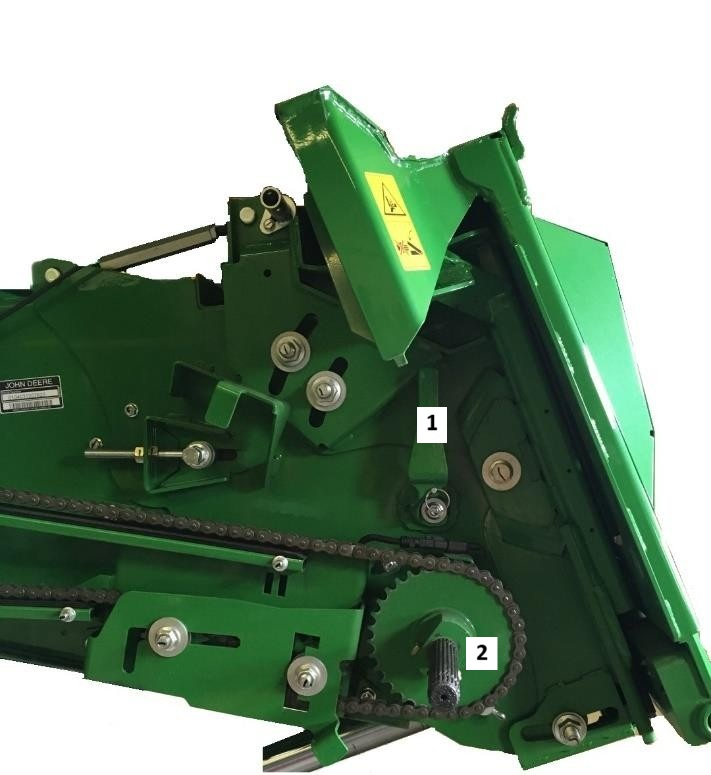
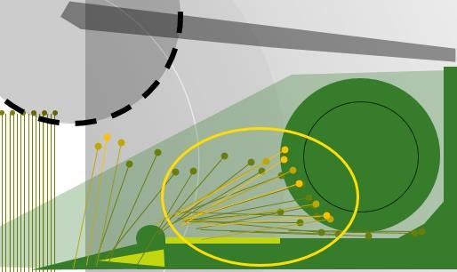

# Conversion de récolte pour séries W et T - Céréales à petits grains  
**Numéro de série supérieur à 102000**  

## Configurer la plate-forme 

1. Réglez la vis d’alimentation et le doigt de vis sans fin en fonction de la culture.  
1. Vérifiez la distance entre la vis d’entrée et les racleurs.  
1. Ajustez les racleurs selon les indications données par les DTAC 76721 (600R) et DTAC 104058 (700X).
1. Ajustez l'angle du convoyeur d'alimentation à l'aide de la barre filetée sur le convoyeur. 
Un angle adapté permet le ramassage la récolte sans pousser la terre. Il doit être positionné à plat ou légérement incliné vers l'avant. 
**Particularités du convoyeur :** 
    * Tambour orienté vers le bas 
    * Pignon à 33 dents
    * Absence de racleur sur l'arbre supérieur.
    * Absence de portes perforées
 
        1 - Leviers droit et gauche vers l'arrière pour la position haute
        2 - Pignon à deux vitesses
5. Réglez la longueur de la table de la 700X en fonction de la hauteur de la culture et des chaumes. Les épis doivent tomber entre les spires de la vis d'alimentation.
 