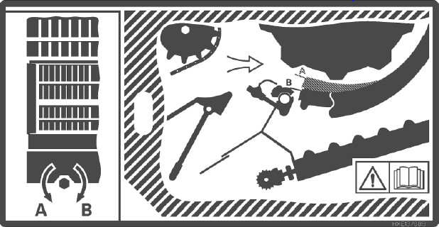

# Installer les contre-batteurs sectionnels

Les contres-batteurs pour céréales à petits grains sont idéales dans des condition de battage et d'ébarbage difficiles.

1. Ouvrez la trappe à pierres.
1. Ouvrez complétement le contre-batteur.
1. Désenclenchez la barre d'amorçage.
1. Ouvrez le mécanisme de verroullage du contre-batteur sectionnel
1. Remplacer les sections du contre-batteur.
1. Fermez le mécanisme de verrouillage.

