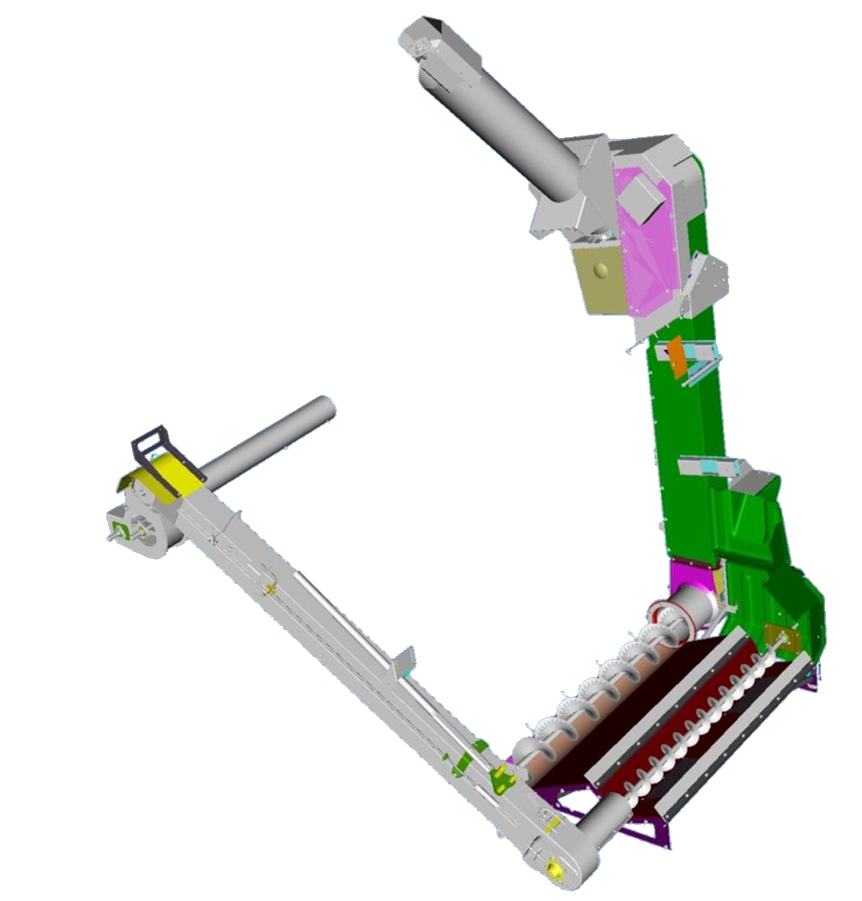
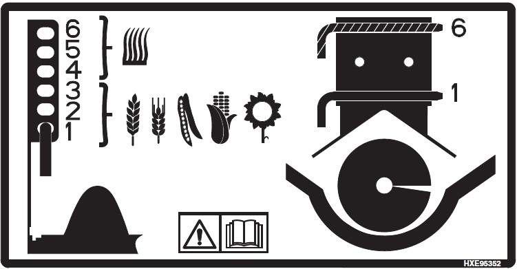

# Manutention du grain

Pour la manutention du grain, réglez les éléments comme suit :
* Les aillettes en acier de l'élévateur à grain propre ne sont pas obligatoires.
* Le couvercle de la vis transversale doit être réglé entre les position 1 et 3.
* La palette à joint de cardan n'est pas obligatoire.
* Les portes perforées de l'élévateur ne sont pas obligatoires.
* Le limiteur de couple n'est pas obligatoire.
* La vitesse de la trémie à grain est standard et ne doit pas être changée.

