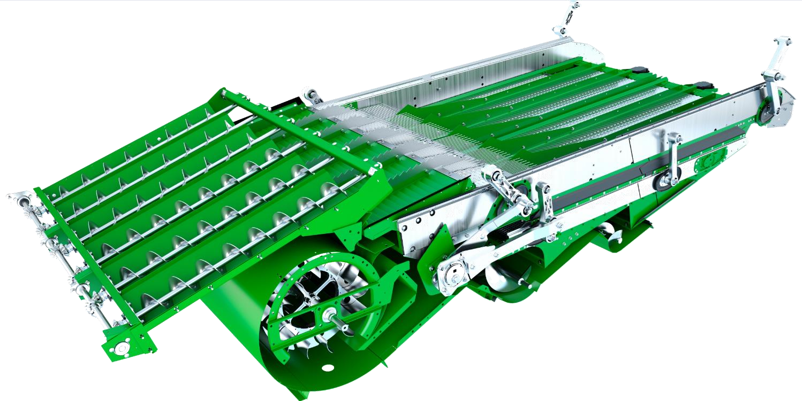
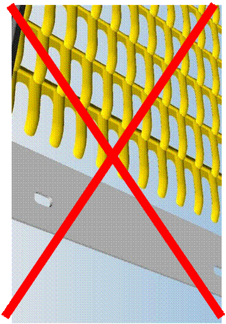
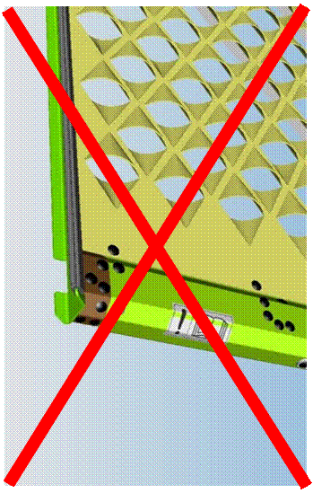

# Nettoyage

## Configuration du caisson de nettoyage.

- **Grille à ôtons (mm) :** 16 – 20 mm  
- **Grille à grain (mm) :** 5 – 9 mm 
- **Couvercle à otons CCM :** Non
- **Régime du ventilateur (tr/min) :** 950 – 1350  
- **Régime du ventilateur à deux plages :** Haut si il est équipé d'un entraînement de ventilateur à deux vitesses.

## Type de caisson de nettoyage - grille à otons/grains
|Standard|Maïs|Haute performance|CCM à lamelles coniques|
|:---:|:---:|:---:|:---:|
|||||