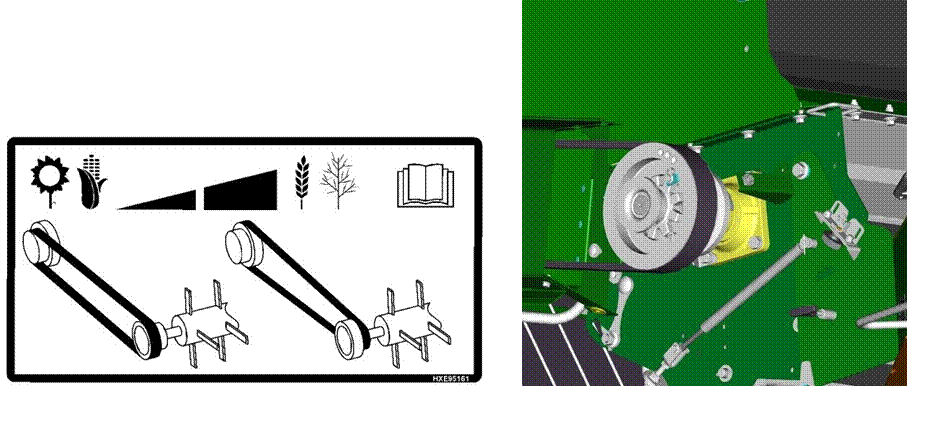
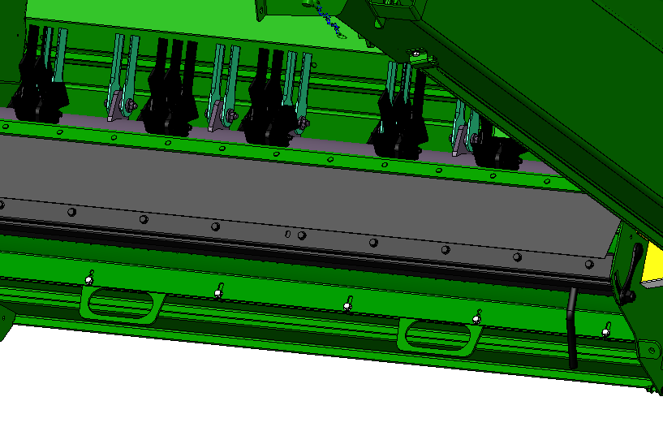
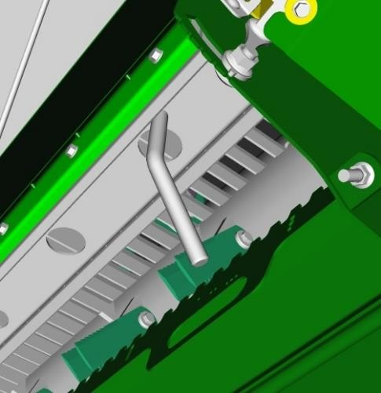
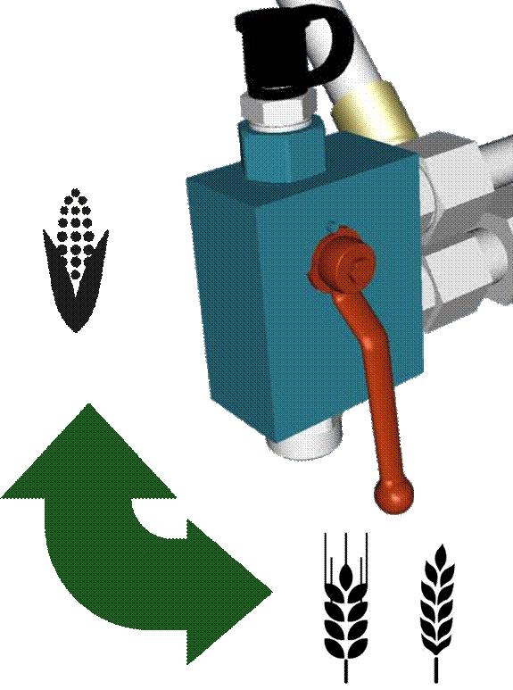
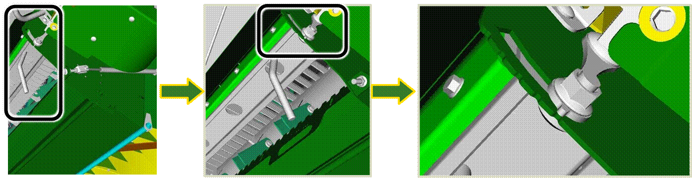
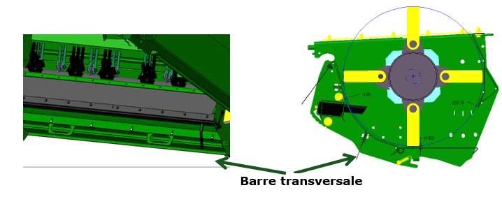

# Gestion des résidus

## Informations générales

Configurez les éléments comme suit :

* Le broyeur tourne à haut régime
* Les contre-couteux sont engagés.
* La barre transversale n'est utilisées qu'en cas de besoin.
* La vanne de vitesse de l'éparpilleurs de menues pailles est réglée sur rapide.
* Le déflecteur de rafles n'est pas nécessaire.

## Configurer l'éparpilleur de menues pailles

1. Réglez les ailettes à la largeur de travail adaptée au type et aux conditions de récoltes
    * **Largeur maximale :** 635
    * **Largeur minimale :** 616
2. Réglez le régimes aux types et aux conditions de récoltes.

## Régler les contre-couteaux

Cette procédure requiert l'utilisation d'un clé. Le réglages des contre-couteaux doit être continu.

1. Réglez les contre-couteaux au plus bas.
2. Adaptez ensuite le réglages en fonction de la qualité du broyage obtenu.
3. Verifiez que les deux cotés soient identiques en vous aidant des rainures.

    **Attention :** Des couteaux placés trop loin n'offrent pas la meilleure qualité de broyage et utilisent beaucoup de puissance.

## Régler la barre transversale

L'utilisation de la barre transversale n'est pas systèmatique. Elle doit être installée seulement dans des conditions de broyage difficile lorsque la qualité obtenue n'est pas satisfaisante.

1. Assurez-vous que les couteaux sont suffisamment affûtés.
1. Engagez la barre transversale.

    **Attention :** L'engagement de la barre transversale augmente la consommation de carburant.
    
