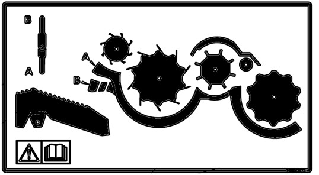
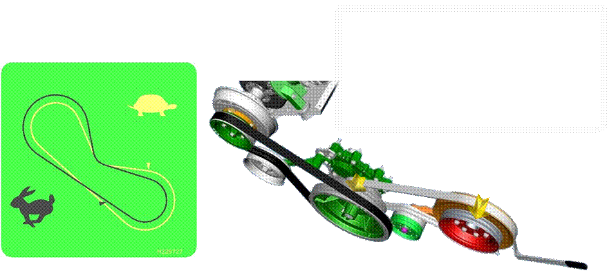
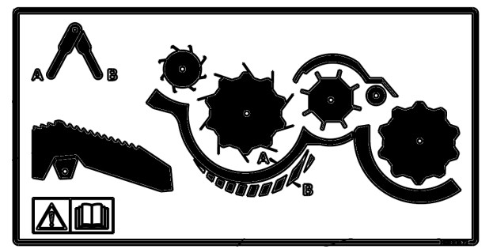

# Configuration de la grille de séparation pour la série T

* La grille de séparation en T est fermée.
* Le contre tire-paille arrière est fermé.
* Le séparateur en T tourne à haut régime.
* Les crêtes sont utilisées seulement si nécessaire.
* Les volets en caoutchouc aux extrémités des secoueurs ne sont pas nécessaires.

