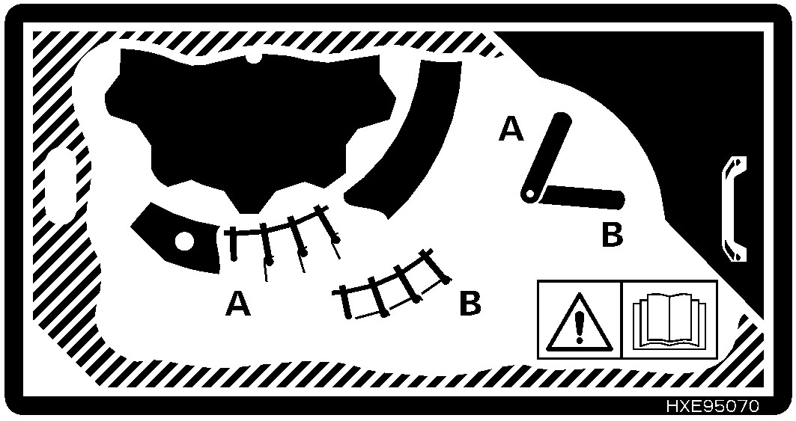
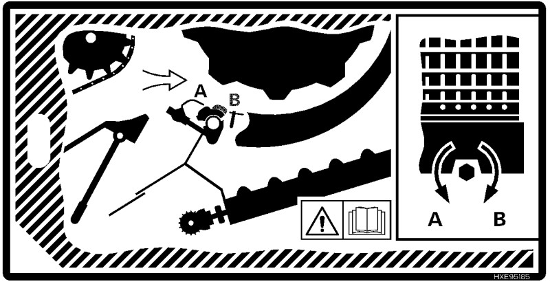

# Ebarber

1. Utilisez la barre d'amorçage.
1. Si l'ébarbage est difficile, utilisez les tôles d'ébarbage.

    **Attention :** Les  tôles d'amorçage limitent la capacité de séparation.

## Faciliter l'ébarbage

1. Enclenchez la barre d'appoint.

1. Fermez le contre-batteur.
1. Augmentez le régime du batteur.
1. Utilisez des sections de contre-batteur à petit fil.

1. Fermez les tôles d'ébarbage.

## Nettoyer le contre-batteur

1. Ouvrez les tôles d'amorçage.
1. Nettoyez le contre-batteur.