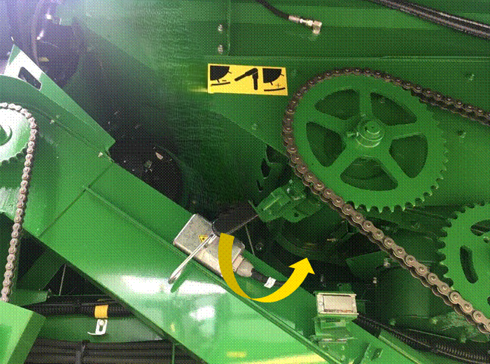

# Configuration de la grille de séparation pour la série T

* Le contre tire-paille arrière est fermé.
* Le tire-paille arrière tourne à moyen ou haut régime.
* Les crêtes sont utilisées seulement si nécessaire.
* Le séparateur transversal à doigts est installé seulement si nécessaire.
* Les volets en caoutchouc aux extrémités des secoueurs ne sont pas nécessaires.
