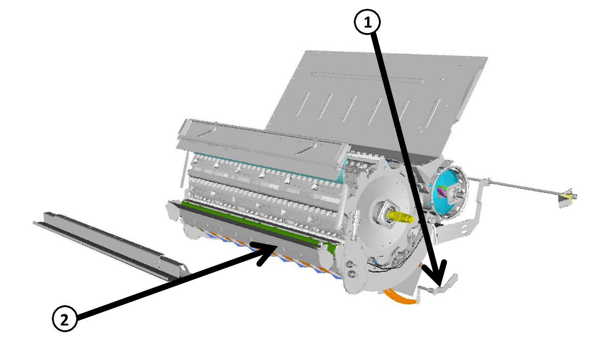

# Battage

## Série - T

### Caractéristiques

<table>
  <tr>
    <th></th>
    <th></th>
  </tr>
  <tr>
    <td>Plaque d'obturation de la trappe à pierres</td>
    <td>
      
Non

    </td>
  </tr>
  <tr>
    <td>Barre d'amorçage</td>
    <td>
      
Non

    </td>
  </tr>
  <tr>
    <td>Contre-batteur</td>
    <td>
      
Céréales à petits grains / Mixte

    </td>
  </tr>
  <tr>
    <td>Plaques d'obturation du batteur</td>
    <td>
      
Non

    </td>
  </tr>
  <tr>
    <td>Tôles d'ébarbage</td>
    <td>
      
Non

    </td>
  </tr>
  <tr>
    <td>Plage de régime du batteur</td>
    <td>
      
basse* / haute*

      
*(si équipé d'un entraînement de batteur à 2 vitesses)

      
Conditions sèches : basse

      
Conditions humides : haute

    </td>
  </tr>
  <tr>
    <td>Régime du batteur (tr/min)</td>
    <td>
      
400-500 : récolte cassante

      
500-650 : récolte verte

    </td>
  </tr>
  <tr>
    <td>Écartement du contre-batteur (mm)</td>
    <td>
      
25-40

    </td>
  </tr>
</table>

*Figure 1 - Battage Série T*

| Repère                   | Description      |
|--------------------------|------------------|
| 1                        | Tôles d'ébarbage |
| 2                        | Barre d'amorçage |

## Série - W

### Caractéristiques

<table>
  <tr>
    <th></th>
    <th></th>
  </tr>
  <tr>
    <td>Plaque d'obturation de la trappe à pierres</td>
    <td>
      
Non

    </td>
  </tr>
  <tr>
    <td>Barre d'amorçage</td>
    <td>
      
Si nécessaire

    </td>
  </tr>
  <tr>
    <td>Contre-batteur</td>
    <td>
      
Céréales à petits grains / Mixte

    </td>
  </tr>
  <tr>
    <td>Plaques d'obturation du batteur</td>
    <td>
      
Non

    </td>
  </tr>
  <tr>
    <td>Tôles d'ébarbage</td>
    <td>
      
Non nécessaire

    </td>
  </tr>
  <tr>
    <td>Plage de régime du batteur</td>
    <td>
      
basse* / haute*

      
*(si équipé d'un entraînement de batteur à 2 vitesses)

      
Conditions sèches : basse

      
Conditions humides : haute

    </td>
  </tr>
  <tr>
    <td>Régime du batteur (tr/min)</td>
    <td>
      
400-500 : récolte cassante

      
500-650 : récolte verte

    </td>
  </tr>
  <tr>
    <td>Écartement du contre-batteur (mm)</td>
    <td>
      
25-40

    </td>
  </tr>
</table>

*Figure 2 - Battage Série W*

| Repère                   | Description                             |
|--------------------------|-----------------------------------------|
| 1                        | Tôles d'ébarbage                        |
| 2                        | Barre d'amorçage à enclenchement rapide |

