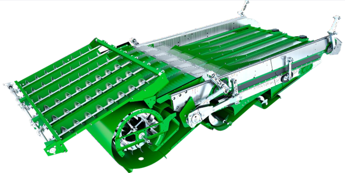

# Caisson de nettoyage

## Caractéristiques

<table>
  <tr>
    <th></th>
    <th></th>
  </tr>
  <tr>
    <td>Grille à ôtons (mm)</td>
    <td>
      
12 - 18 mm

      
Standard ou HP

    </td>
  </tr>
  <tr>
    <td>Grille à grain (mm)</td>
    <td>
      
3 - 6 mm

      
Standard

    </td>
  </tr>
  <tr>
    <td>Contre-batteur</td>
    <td>
      
Céréales à petits grains / Mixte

    </td>
  </tr>
  <tr>
    <td>Couvercle à ôtons CCM</td>
    <td>
      
Non

    </td>
  </tr>
  <tr>
    <td>Régime du ventilateur (tr/min)</td>
    <td>
      
750 -1050

    </td>
  </tr>
  <tr>
    <td>Régime du ventilateur à deux plages</td>
    <td>
      
haute*

      
*(si équipé d'un entraînement de batteur à 2 vitesses)

    </td>
  </tr>
</table>

*Figure 1 - Caisson de nettoyage*

