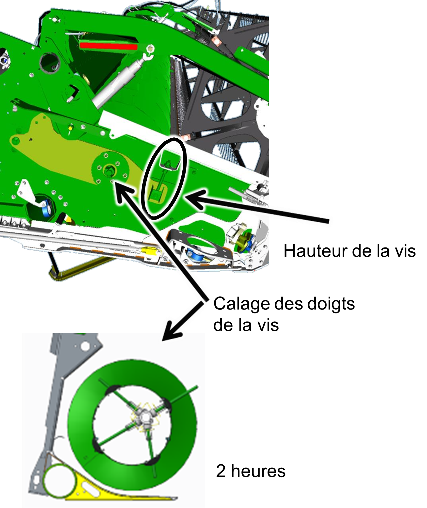

# Configuration de la plateforme (sauts de ligne à revoir)

  <strong>⚠️ Important :</strong>

* En fonction de la culture, réglez la vis d'alimentation et le doigt de vis sans fin, représentés dans l'image ci-dessous.

*Figure 1 - Vis d'alimentation et doigt de vis sans fin*

* Vérifiez la distance entre la vis d'entrée et les racleurs.  
La vis d'entrée et les racleurs sont encadrés en jaune dans l'image suivante :

*Figure 2 - Distance entre la vis d'entrée et les racleurs* 

* Réglez les racleurs selon les indications des DTAC 76721 (600R) et DTAC 107058 (700X).

## Installation d'équipement spécifique au colza sur la plateforme

Installez tous les équipements spécifiques au colza sur votre plateforme :

* Extension pour le colza (600R)
* Couteaux latéraux
* Jeu de joints centraux (700D et 700FD)

En cas de problème d'alimentation avec du colza à haut rendement :

1. Relevez la vis d'alimentation.
1. Réglez le calage des doigts de vis d'alimentation à 2 heures.
1. Réglez la tension de la chaîne d’entraînement et des racleurs arrière lors du réglage de la hauteur de la vis d'alimentation.

Le schéma suivant illustre le réglage de la vis d'alimentation :

*Figure 3 - Réglage de la vis d'alimentation*

## Longueur de table

Réglez la longueur de table de la 700X en fonction de la hauteur de la culture et de la hauteur des chaumes.

Réglez la longueur de la table de façon à ce que la tête des plants tombe entre les spires de la vis d'alimentation.  
Prenez comme exemple l'illustration ci-dessous.

*Figure 4 - Réglage de la longueur de la table*

