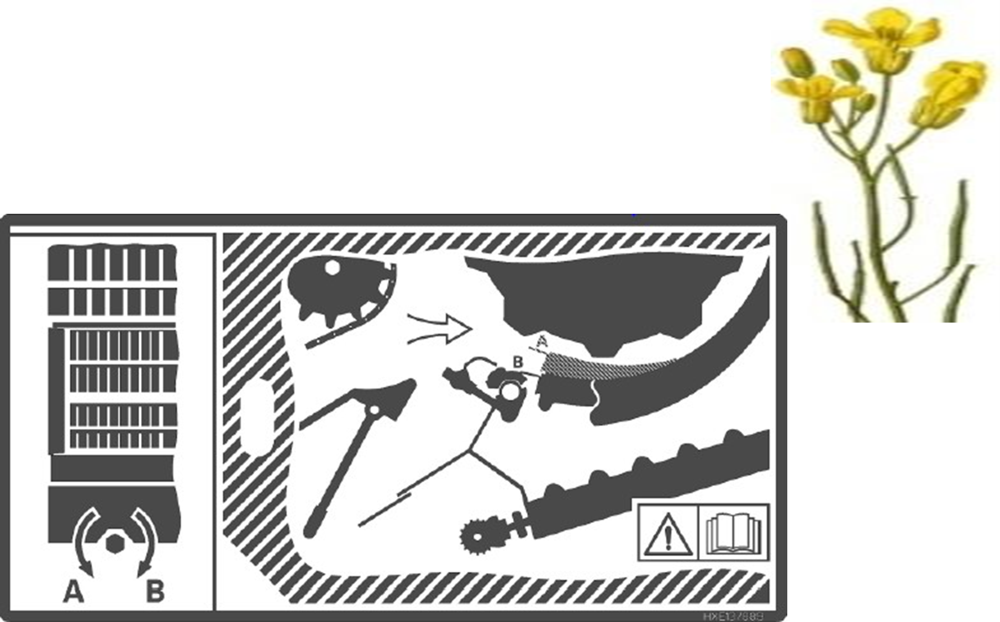
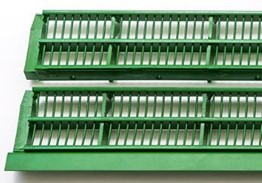
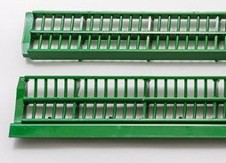

# Contre-batteurs sectionnels

## Procédure

 1. Ouvrez la trappe à pierres.
 2. Ouvrez complètement le contre-batteur.
 3. Désenclenchez la barre d’amorçage.
 4. Ouvrez le mécanisme de verrouillage du contre-batteur sectionnel.
 5. Remplacez les sections du contre-batteur.
 6. Fermez le mécanisme de verrouillage.

*Schéma 1 - Contre-batteur sectionnel*

Dans des conditions sèches et cassantes, des sections pour petits grains peuvent aider à réduire la charge du caisson de nettoyage.

*Figure 1 - Section pour petits grains*

Dans des conditions humides, un contre-batteur mixte améliore la séparation.

*Figure 2 - Section mixte*