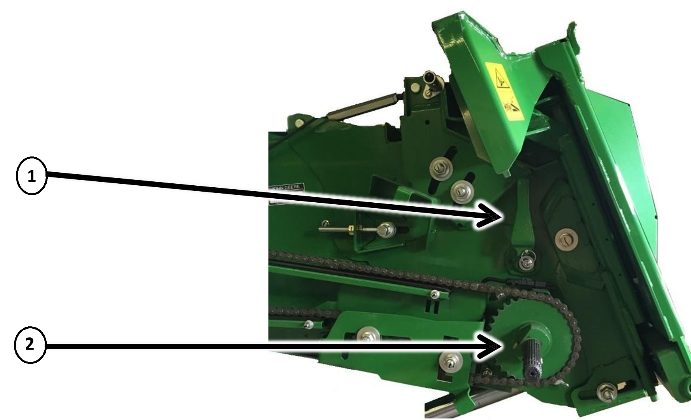
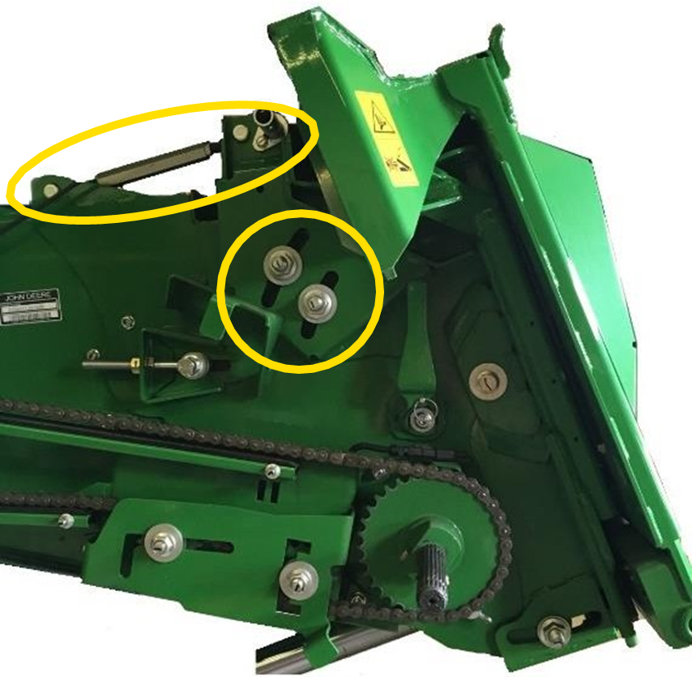

# Convoyeur d'alimentation

## Caractéristiques du convoyeur d'alimentation

|                                   |                                 |
|-----------------------------------|---------------------------------|
| Position du tambour               | En haut (levier vers l’arrière) |
| Pignon                            | 33 dents                        |
| Racleur de l’arbre supérieur      | Non                             |
| Portes perforées                  | Non                             |

*Figure 1 - Position du tambour et du pignon*

| Repère                   | Description                                                                                      |
|--------------------------|--------------------------------------------------------------------------------------------------|
| 1                        | Position du tambour : leviers du côté gauche et droit vers l'arrière (position haute sur l'image)|
| 2                        | Pignon : standard ou à 2 vitesses avec 33 dents                                                  |

## Angle du convoyeur d'alimentation

Réglez l’angle du convoyeur d’alimentation pour qu’il soit à plat ou légèrement incliné vers l’avant.  
Cela permet le ramassage de la récolte sans pousser de la terre.  
Un exemple de réglage de l'angle du convoyeur est donné dans l'image ci-dessous.

*Figure 2 - Angle du convoyeur d'alimentation*

**Note :** Vous pouvez ajuster l'angle à l'aide de la barre filetée sur le convoyeur d'alimentation.  
Si vous devez modifier le réglage sur une autre unité de récolte, consultez le livret d'entretien correspondant.

