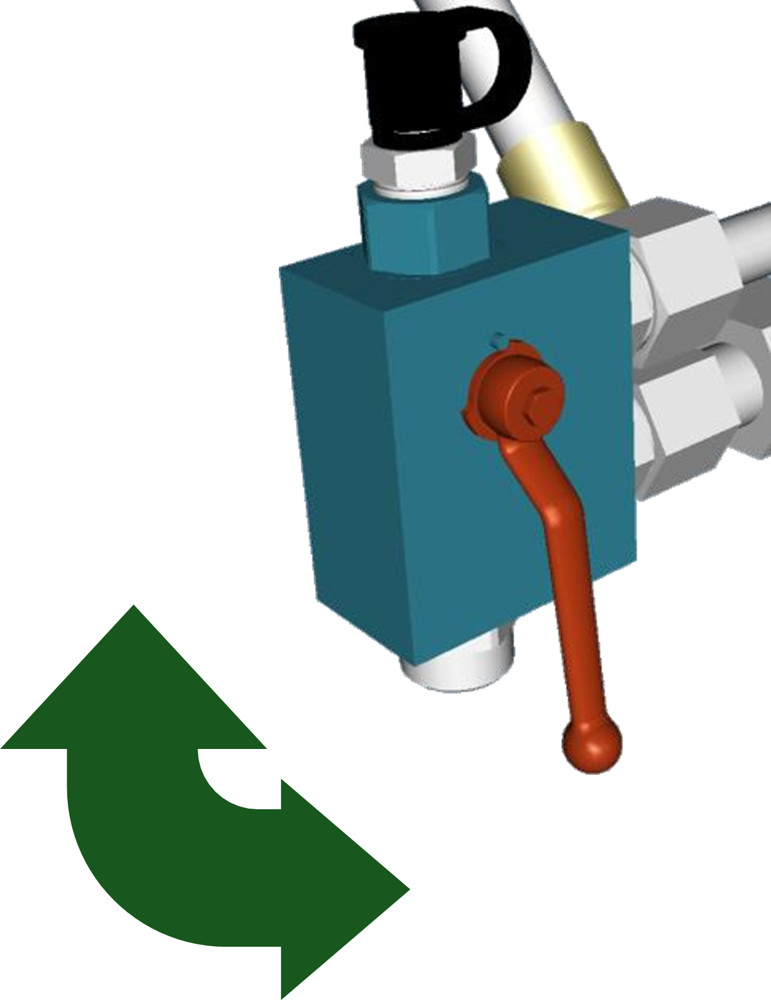

# Éparpilleur de menues pailles : régime et ailettes

## Réglage des ailettes

Réglez les ailettes à la largeur de travail adaptée au type et aux conditions de récolte :

* 635 : ailette complètement en haut
* 616 : ailette complètement en bas

*Figure 1 - Ailette complètement en bas pour type de récolte 616*

