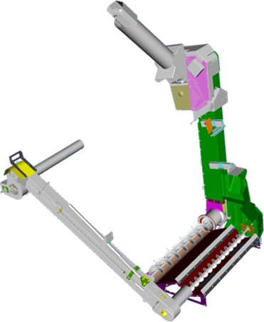
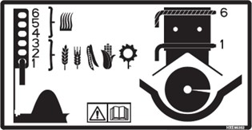

# Manutention du grain

## Caractéristiques

|                                                   |                 |
|---------------------------------------------------|-----------------|
| Ailettes en acier de l'élévateur à grain propre   | Pas obligatoire |
| Position du couvercle de la vis transversale      | 1 - 3           |
| Palette à joint de cardan                         | Pas obligatoire |
| Portes perforées d'élévateur, etc.                | Non             |
| Limiteur de couple                                | Pas obligatoire |
| Changement des vitesses de la trémie à grain      | Non - standard  |

*Figure 1 - Manutention du grain*

*Schéma 1 - Position du couvercle de la vis transversale*