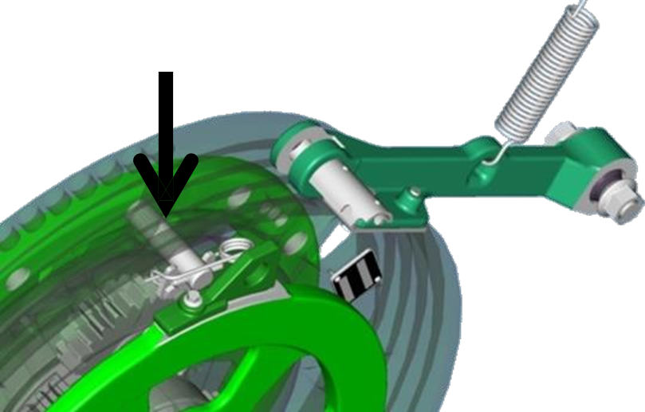
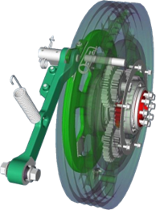
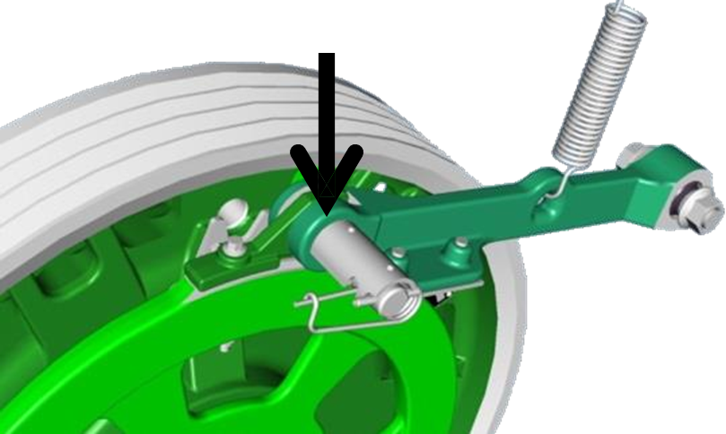

# Plage de régime du batteur : positions des axes (sauts de ligne)

## Prérequis

La machine doit être équipée d'un entraînement de batteur à 2 vitesses.

### Haut

* Axe de verrouillage intérieur engagé
* Poulie extérieure libre

*Figure 1 - Vue de la face avant de l'axe haut du batteur*

*Figure 2 - Vue de la face arrière de l'axe haut du batteur*

### Bas

* Axe de verrouillage intérieur libre
* Poulie extérieure verrouillée

**Note :**
* Récolte cassante : plage basse
* Récolte verte : plage haute

  <strong>⚠️ Important :</strong>

Ne pas faire fonctionner à régime très bas en plage haute.  
Réduisez le régime au plus bas possible du batteur et augmentez ensuite de 20 tr/min.

