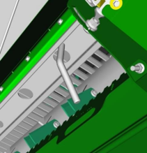
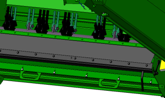

# Résidus

## Caractéristiques

|                                                                          |               |                                          |
|--------------------------------------------------------------------------|---------------|------------------------------------------|
| Régime du broyeur                                                        | Régime haut   |  |
| Position des contre-couteaux                                             | Désenclenchée |     |
| Position de la barre d'affinage                                          | Désenclenchée |   |
| Vanne de vitesse de l'éparpilleur de menues pailles (selon l'équipement) | Rapide        |                                          |
| Détecteur de rafles                                                      | Non           |                                          |

*Schéma 1 - Régime du broyeur*