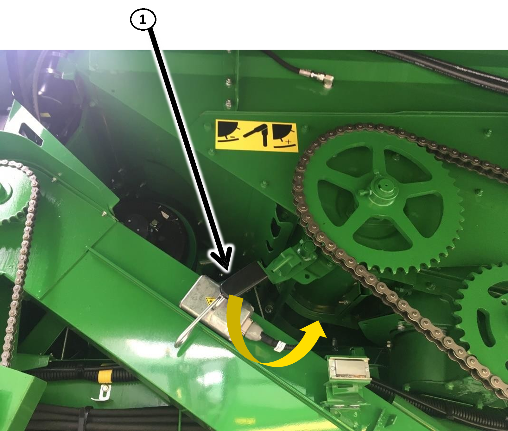

# Séparation

## Série T

|                                                   |                                                                       |
|---------------------------------------------------|-----------------------------------------------------------------------|
| Position de la grille de séparation T             | Ouverte                                                               |
| Position du contre tire-paille arrière            | Ouverte                                                               |
| Régime du séparateur T                            | Rapide (le régime bas peut être nécessaire en conditions très sèches) |
| Crêtes                                            | Non nécessaire                                                        |
| Volets en caoutchouc aux extrémités des secoueurs | Non nécessaire                                                        |

| Repère                   | Description                            |
|--------------------------|----------------------------------------|
| 1                        | Position du contre tire-paille arrière |
| 2                        | Position de la grille de séparation    |

*Figure 1 - Régime des organes de battage (régime rapide en noir)*

## Série W

|                                                   |                 |
|---------------------------------------------------|-----------------|
| Position du contre tire-paille arrière            | Ouverte         |
| Réduction du régime du tire-paille arrière        | Non             |
| Crête                                             | Pas obligatoire |
| Séparateur transversal à doigts                   | Pas obligatoire |
| Volet en caoutchouc                               | Pas obligatoire |

| Repère                   | Description                            |
|--------------------------|----------------------------------------|
| 1                        | Position du contre tire-paille arrière |

