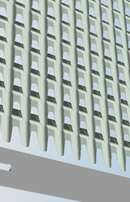
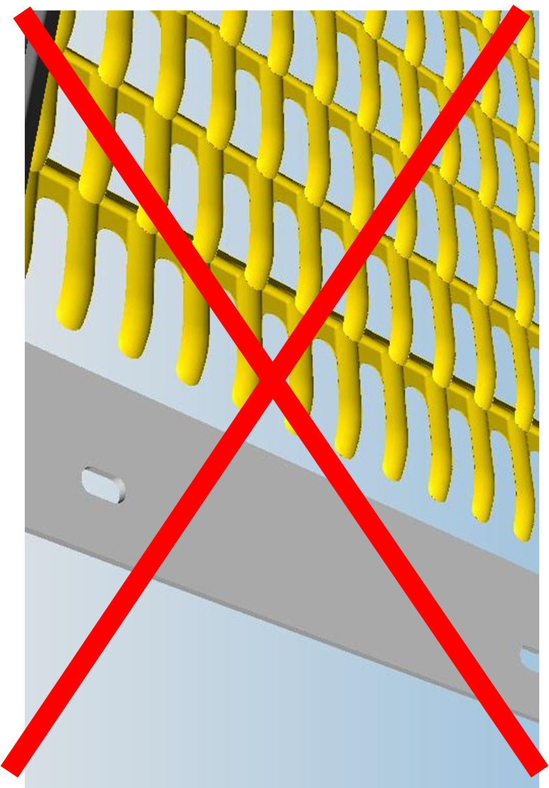
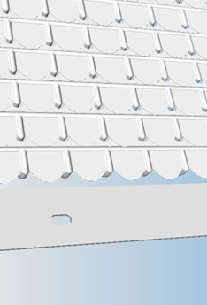
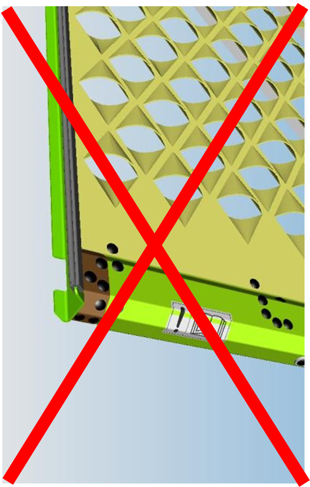

# Type de caisson de nettoyage - grille à ôtons / grille à grain

| Standard                                        | Maïs (ex. CZ4)                              | HP (hautes performances)                  | CCM - à lamelles coniques                  |
|-------------------------------------------------|---------------------------------------------|-------------------------------------------|--------------------------------------------|
|  |  |  |  |
