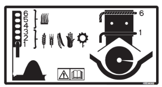

## Manutention du grain

| Élément | Réglage |
|---------------------------------------------|-------------------------------------------------------|
| Ailettes en acier de l’élévateur à grain propre | Si nécessaire                                      |
| Position du couvercle de la vis transversale | 1–3                                                  |
| Palette à joint de cardan                   | Pas obligatoire                                       |
| Portes perforées d’élévateur, etc.          | Si nécessaire                                         |
| Limiteur de couple                          | Oui *en conditions humides*                         |
| Changement des vitesses de la trémie à grain| Non – standard      

