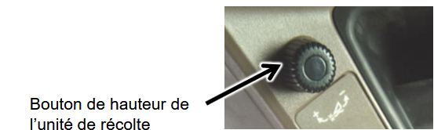
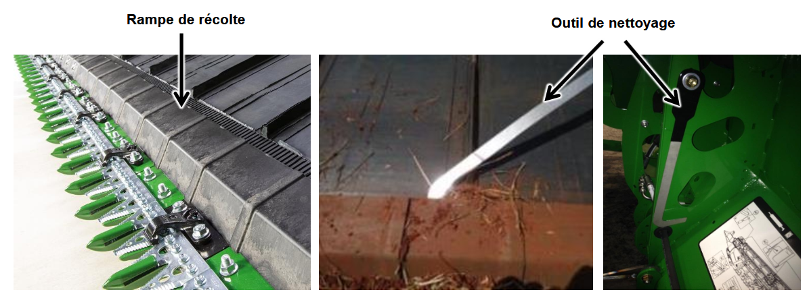

## Configuration de la plateforme
Les modèles 600F et 700FD utilisent une pression hydraulique différente pour la barre de coupe en raison de leurs géométries distinctes.  

### Réglage de pression de la barre de coupe selon le terrain :  
| Type de terrain | 600F (bar) | 700FD (bar) |
|----------------|------------|------------|
| Sec et dur    | 70         | 75         |
| Normal        | 80         | 90         |
| Souple et humide | 90     | 110        |

 

### Modèle 700D

 
 
Dans des conditions très humides avec un sol collant, il peut être nécessaire de nettoyer la rampe de récolte.  

1. Préparer l’extracteur de récolte.
2. Glissez l’extracteur entre la courroie et la rampe de récolte.
3. Tirez la récolte vers le centre de l’unité de récolte pour la dégager.  
