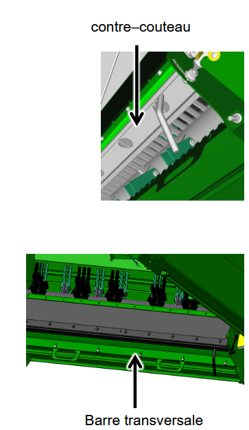
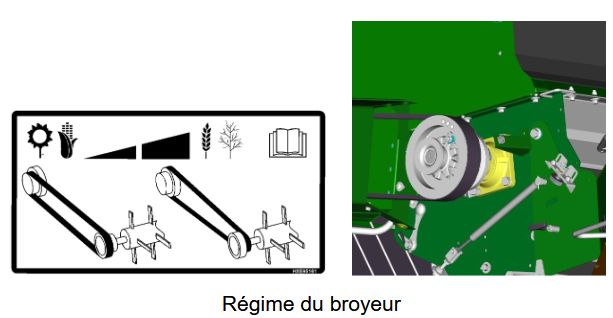

## Configuration pour la manutention

| Élément | Réglage |
|------------------------------------------------------------------|-----------------------------|
| Régime du broyeur                                                | Bas                         |
| Position des contre-couteaux                                     | Désenclenchée               |
| Barre transversale                                               | Désenclenchée               |
| Vanne de vitesse de l’éparpilleur de menues pailles *(si équipé)*| Rapide                      |
| Déflecteur de rafles                                             | Non                         |

 
 
