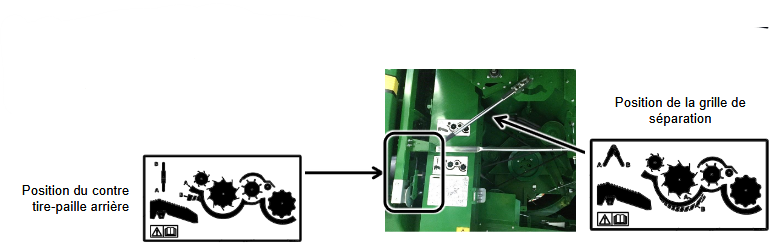
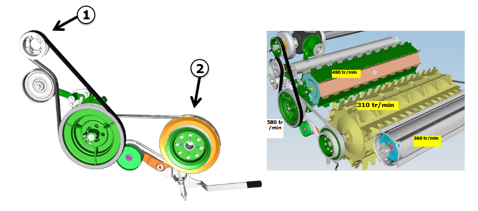
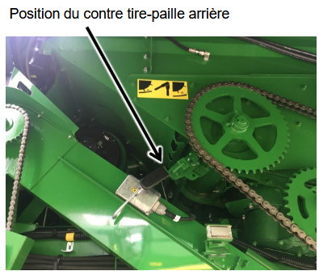
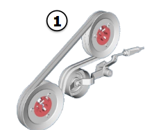
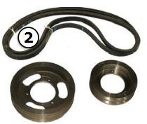

## Configuration de la séparation

### Série T

| Élément                   | Réglage            |
|-----------------------------------|--------------------------|
| Position de la grille de séparation | Ouverte              |
| Position du contre tire-paille arrière | Ouverte              |
| Régime du séparateur          | Bas                      |
| Crête                             | Non nécessaire           |
| Volet en caoutchouc               | Non nécessaire           |

#### Réduction de régime du séparateur selon la culture

| Culture          | Réduction de régime |
|-----------------------|--------------------------|
| Pois                  | Oui                      |
| Lupins, pois chiches, soja | Non                      

#### Pièce du séparateur T

Pour le maïs et les autres grains utilisez un régime recommandé de 310 tr/min.

1. Puissance provenant du boîtier d’engrenages 
2. Séparateur standard - bas

### Série W

| Élément                        | Réglage                                                            |
|-------------------------------------|----------------------------------------------------------------------------|
| Position du contre tire-paille      | Ouverte                                                                    |
| Réduction du régime du tire-paille  | Oui, si la qualité des graines est importante Adresse RC1 140 pour régime normal - 100 pour régime réduit - 75                       |
| Crêtes                              | Non                                                                        |
| Séparateur transversal à doigts     | Non                                                                        |
| Volet en caoutchouc                 | Non nécessaire                                                             |

| Configuration des poulies et courroies           | Dimensions      | Références                       | Images|
|-----------------------------|-------------------------|-----------------------------------------|----------|
| Avec réduction de vitesse   | 286 mm et 217 mm        | AH163931, H135849, H135850              ||
| Sans réduction de vitesse   | 266 mm (chacune)        | —                                       ||

