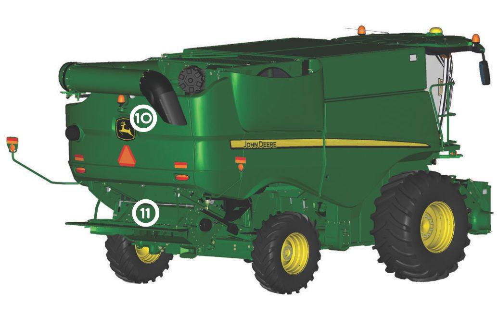
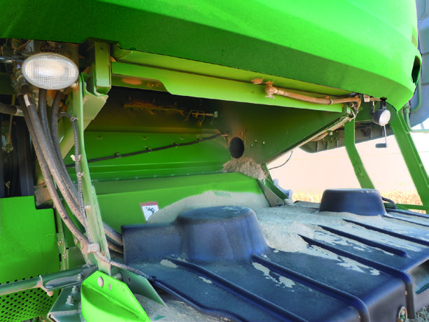

### Vue arrière droite de la moissonneuse-batteuse

#### Compartiment moteur

| Numéro | Élement | Image |
| :----: | :-----: | :---: |
| 10 | Dessus du réservoir de carburant |  |

#### Accessible du sol

| Numéro | Élement | Image |
| :----: | :-----: | :---: |
| 11 | Hayon arrière et dessous du réservoir de carburant |  |
