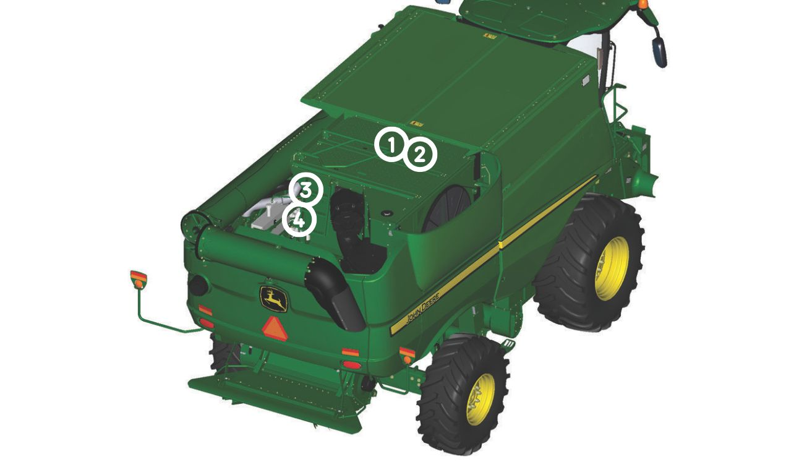
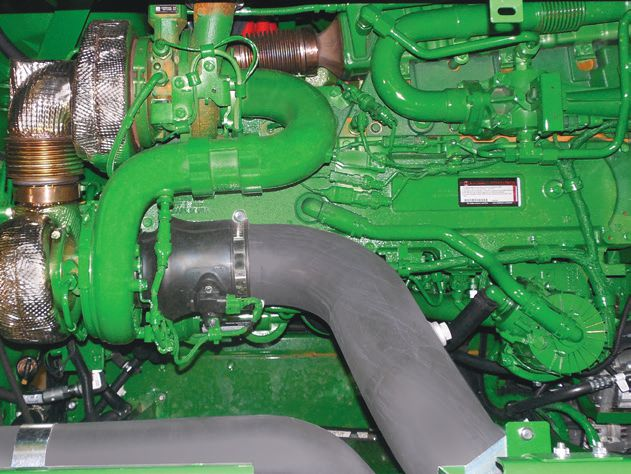
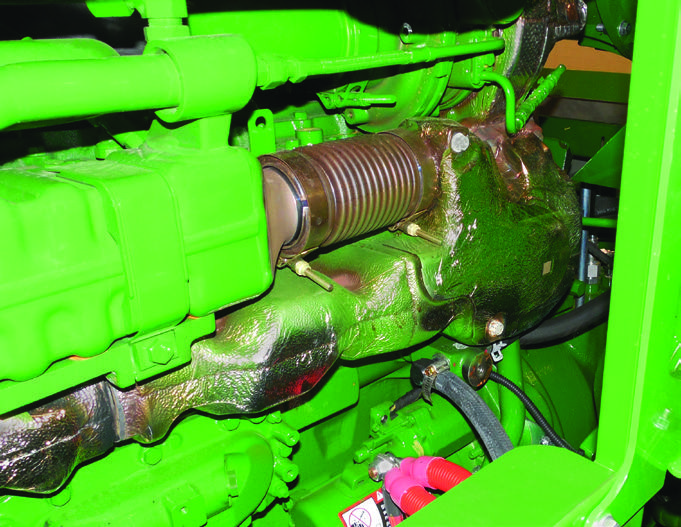
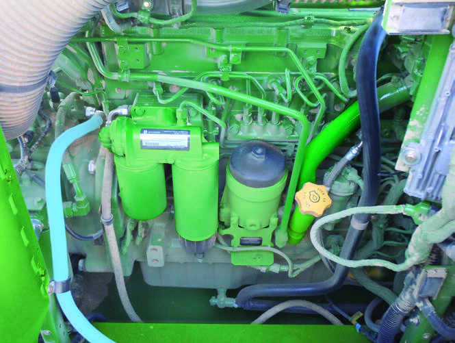
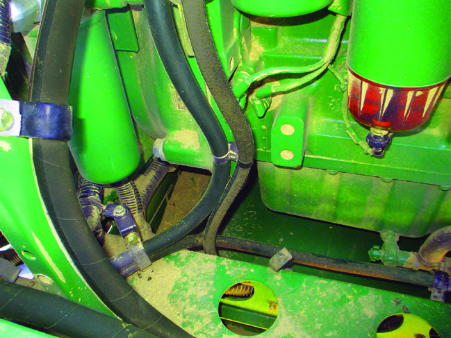

### Vue arrière droite en hauteur de la moissonneuse-batteuse

#### Plate-forme du moteur

Note : Ce schéma illustre FT4, le Tier2 diffère légèrement

| Numéro | Élement | Image |
| :----: | :-----: | :---: |
| 1 | Zone du dessus du moteur et des turbocompresseur |  |
| 2 | Collecteur d'échappement et sa protection, tube d'interétage de turbocompresseur, tube de refroidissement de recirculation des gaz d'échappement |  |
| 3 | Autour du moteur |  |
| 4 | En dessous du moteur |  |
