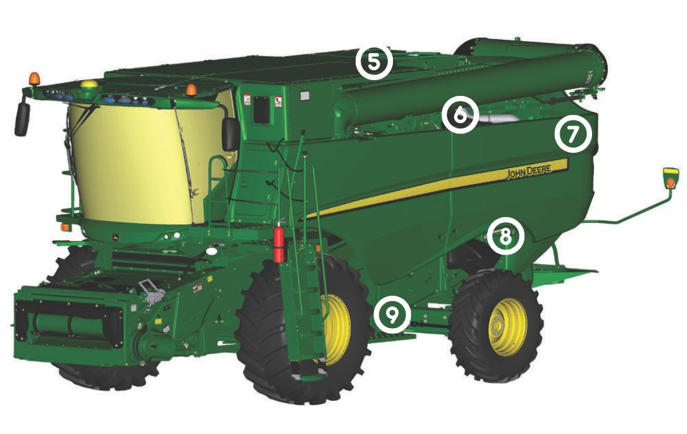
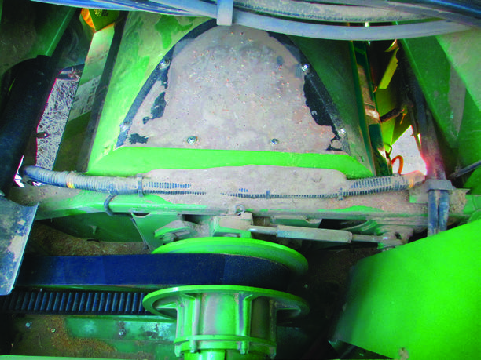
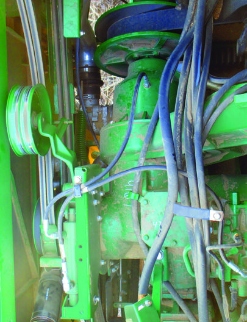
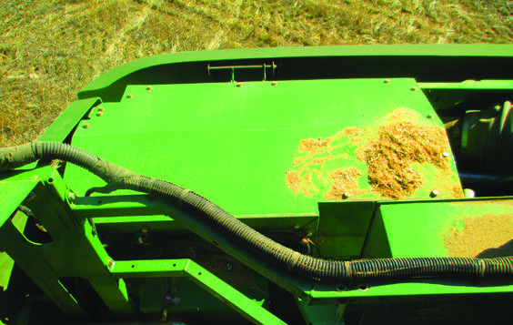
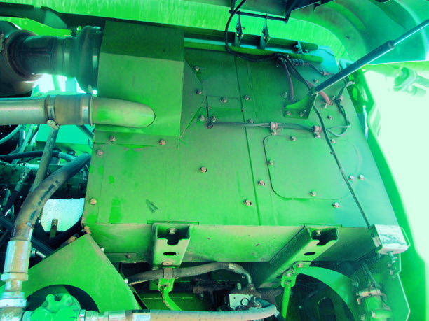
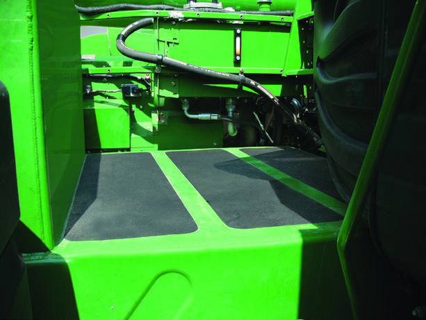
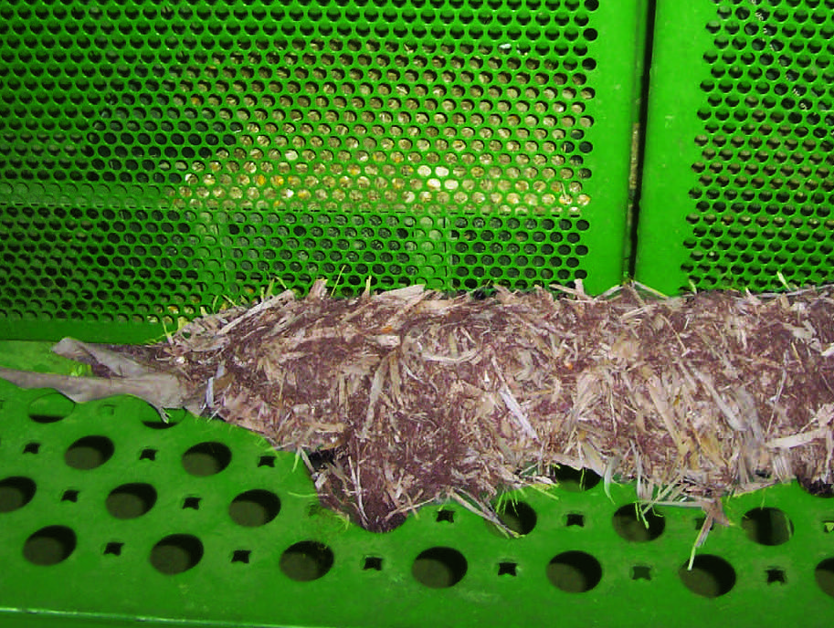
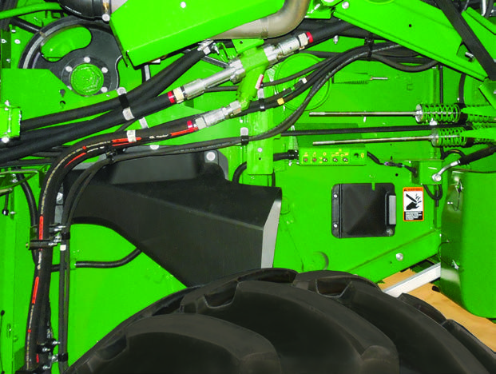

### Vue avant gauche de la moissonneuse-batteuse

#### Compartiment moteur

| Numéro | Élement | Image |
| :----: | :-----: | :---: |
| 5 | Partie supérieure arrière du rotor et zones entourant l'entraînement du rotor |  |
| 6 | Boîte d'engrenages principale du moteur |  |
| 7 | Zones autour de l'enceinte de post-traitement des gaz d'échappement |  |
| 7 | Zones en dessous de l'enceinte de post-traitement des gaz d'échappement |  |
| 8 | Dessus du réservoir de carburant |  |
     
#### Accesible au sol

| Numéro | Élement | Image |
| :----: | :-----: | :---: |
| 9 | Zone du marchepied de gauche |  |
| 10 | Zones de paroi latérale de gauche |  |