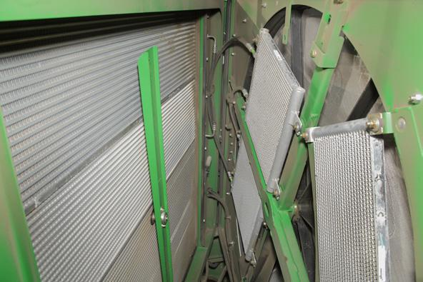

### Vue arrière droite de la moissonneuse-batteuse

#### Plate-forme du moteur

Note : Ce schéma illustre FT4, le Tier2 diffère légèrement

| Numéro | Élement | Image |
| :----: | :-----: | :---: |
| 1 | Zone de plate-forme d’accès arrière et bloc de refroidissement |  |
| 2 | Zone sous le moteur |  |
| 3 | Boîte d’engrenages principale du moteur |  |
| 4 | Zone en haut du moteur, autour du turbocompresseur et alternateurs |  |
| 5 | Zone derrière le moteur _(Accessible par la trémie à grain– uniquement pour les moteurs 9,0 l)_ |  |