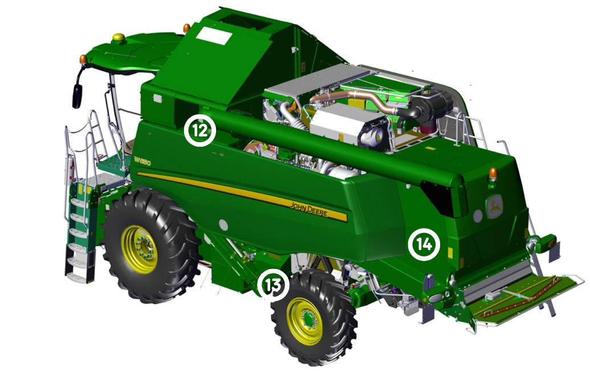
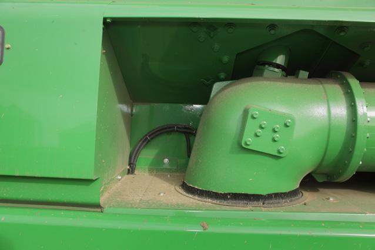
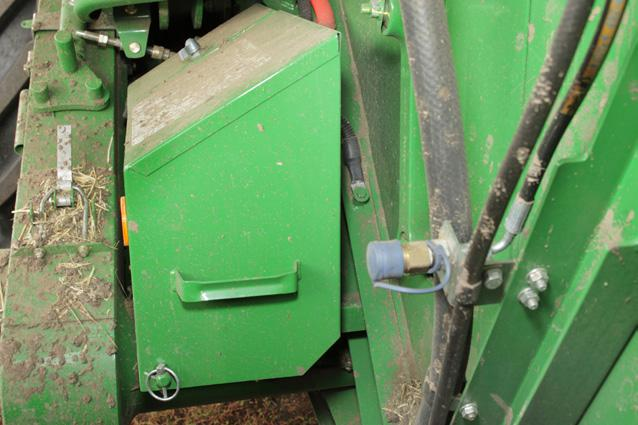
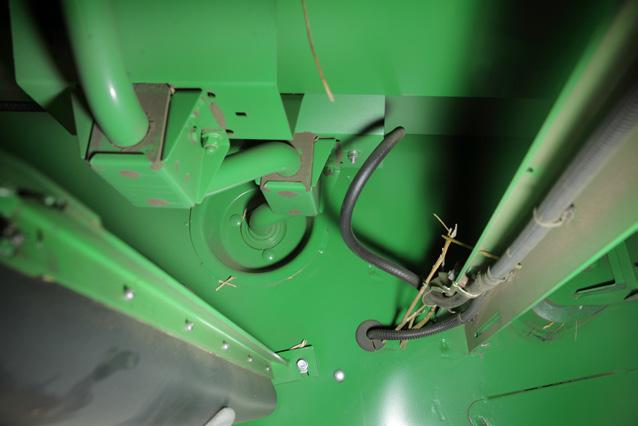

### Vue arrière gauche de la moissonneuse-batteuse

#### Protections et renforts

| Numéro | Élement | Image |
| :----: | :-----: | :---: |
| 12 | Zone autour de la tourelle de la goulotte de vidange |  |

#### Faisceaux et flexibles hydrauliques

| Numéro | Élement | Image |
| :----: | :-----: | :---: |
| 13 | Zone derrière le compartiment batterie |  |

#### Zone du capot arrière

| Numéro | Élement | Image |
| :----: | :-----: | :---: |
| 14 | Zone derrière le compartiment batterie |  |