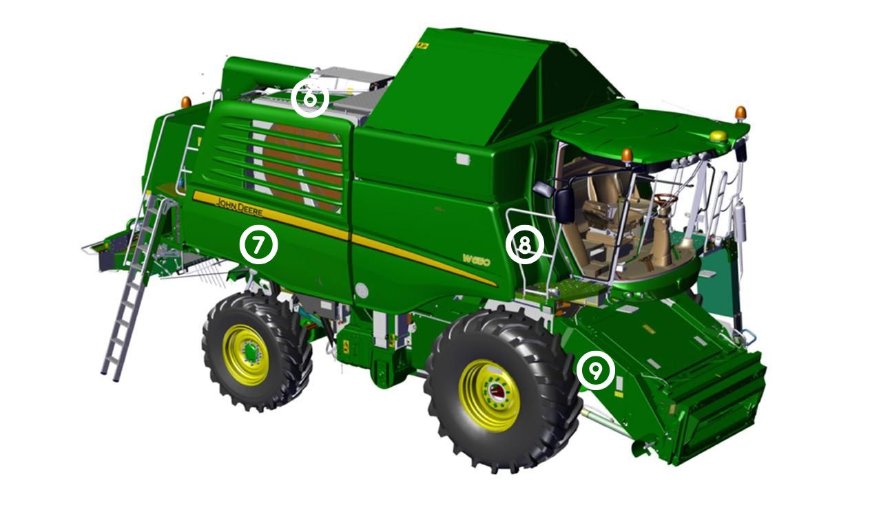
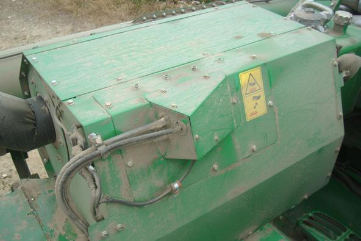
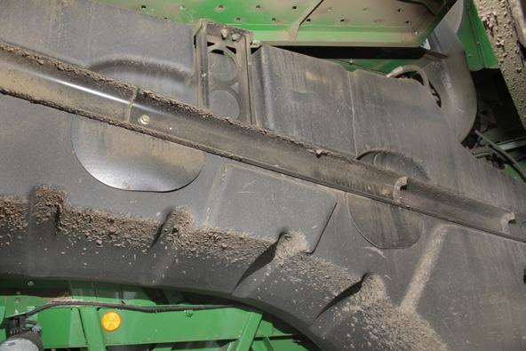
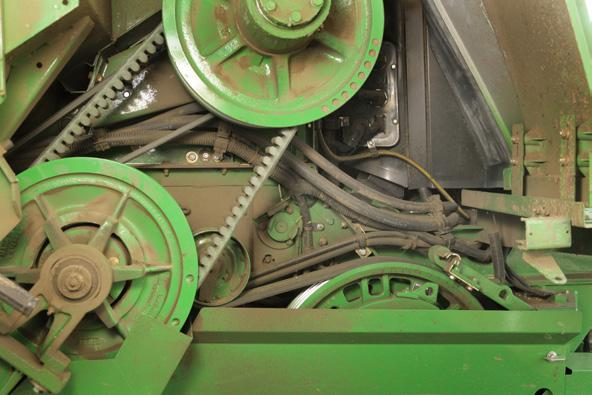
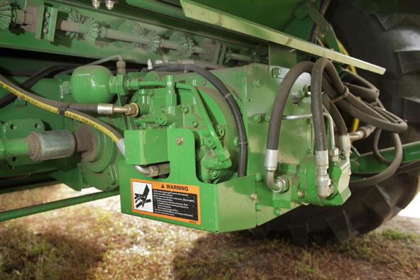

### Vue avant droite de la moissonneuse-batteuse

#### Plate-forme du moteur

Note : Ce schéma illustre FT4, le Tier2 diffère légèrement

| Numéro | Élement | Image |
| :----: | :-----: | :---: |
| 6 | Zone autour du réservoir d’huile hydraulique et d’échappement |  |

#### Faisceaux, flexibles hydrauliques et réservoir de carburant
| Numéro | Élement | Image |
| :----: | :-----: | :---: |
| 7 | Zone autour du réservoir de carburant et des cavités de support |  |
| 8 | Zone de la cabine _(côté droit)_ |  |

#### Transmissions
| Numéro | Élement | Image |
| :----: | :-----: | :---: |
| 9 | Transmission à 3 vitesses ou transmission **ProDrive™** |  |