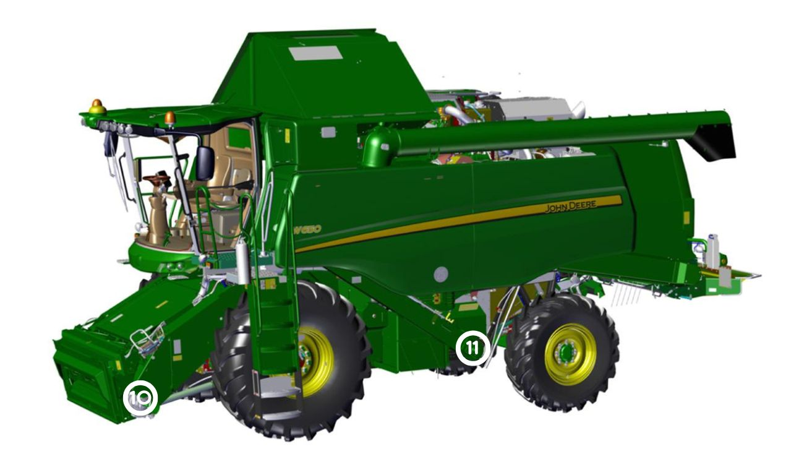
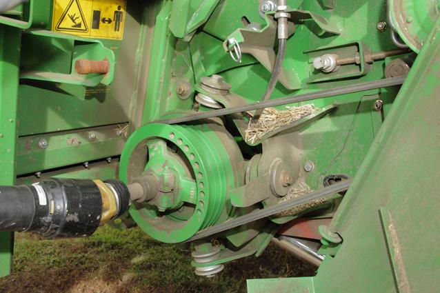
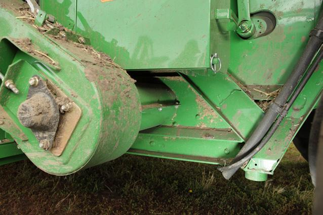

### Vue avant gauche de la moissonneuse-batteuse

#### Protections et renforts

| Numéro | Élement | Image |
| :----: | :-----: | :---: |
| 10 | Convoyeur d’alimentation sur la boîte d’engrenages de l’inverseur _(côté gauche)_ |  |
| 11 | Châssis derrière l’élévateur à otons _(côté gauche)_ |  |
