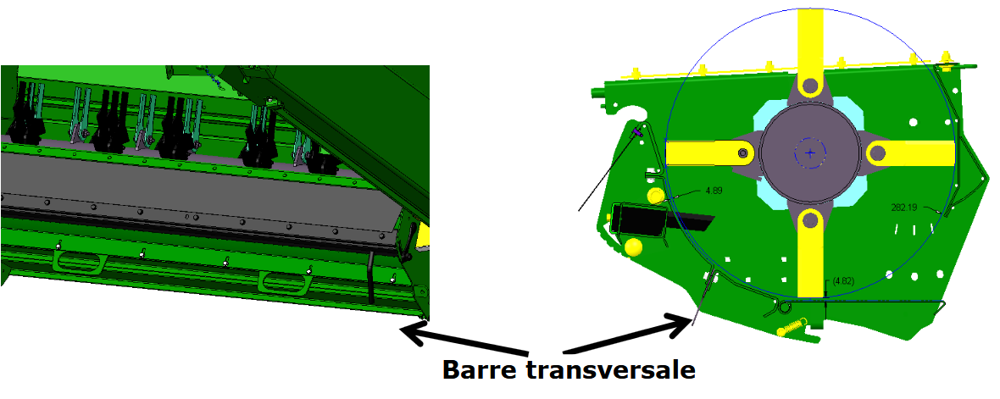

## Résidus - Barre transversale

La **barre transversale** est disponible sur les broyeurs coupe fine et extra-fine de série.

La **barre transversale** est nécessaire dans des conditions difficiles, notamment lorsqu'une qualité de broyage optimale ne peut pas être atteinte via le réglage des
contre-couteaux.

Avant d’utiliser la **barre transversale**, vérifiez que les contre-couteaux sont suffisamment affûtés.

Attention : L’utilisation de la **barre transversale** augmente la consommation de carburant.

 
