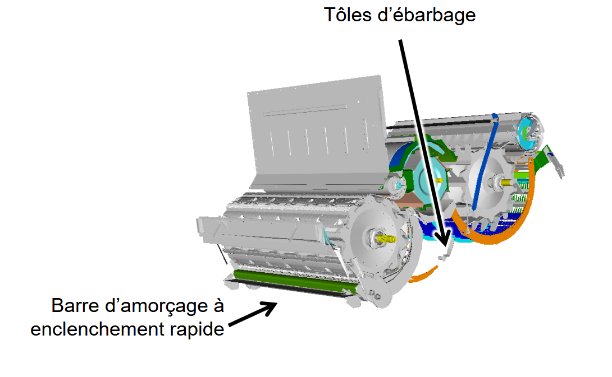
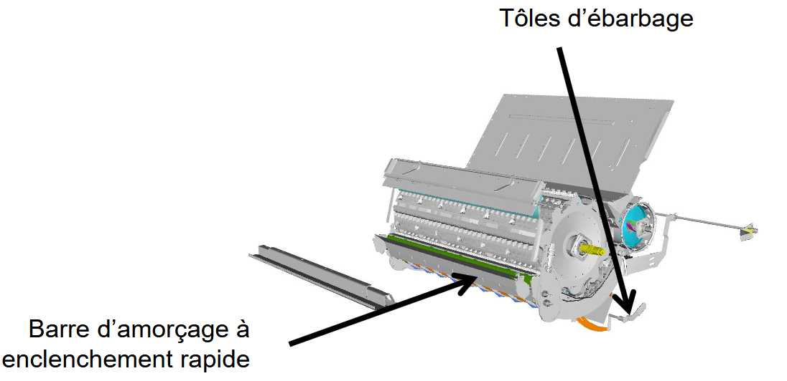

# Battage

## Battage – Série T

| Élément | Réglage |
|---------|---------|
| Tôles d’ébarbage | Non |
| Barre d’amorçage | Non |
| Contre-batteur | Mixte |
| Plaques d’obturation du batteur | Non |
| Plage de régime du batteur | Haut (si équipé d’un entraînement à 2 vitesses) |
| Régime du batteur (tr/min) | 650 – 950 |
| Écartement du contre-batteur (mm) | 5 – 10 |

## Battage – Série W

| Élément | Réglage |
|---------|---------|
| Plaque d’obturation de la trappe à pierres | Non |
| Barre d’amorçage | Non |
| Contre-batteur | Mixte |
| Plaques d’obturation du batteur | Non |
| Tôles d’ébarbage | Non |
| Plage de régime du batteur | Haut (si équipé d’un entraînement à 2 vitesses) |
| Régime du batteur (tr/min) | 650 – 950 |
| Écartement du contre-batteur (mm) | 5 – 10 |

