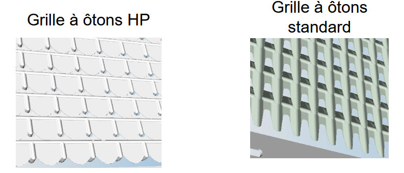

## Caisson de nettoyage

| Élément | Réglage |
|---------|---------|
| Grille à ôtons (mm) | 8 – 15 mm (Standard ou HP) |
| Grille à grain (mm) | 2 – 8 (Standard) |
| Couvercle à ôtons CCM | Non |
| Régime du ventilateur (tr/min) | 440 – 650 |
| Régime du ventilateur à deux plages | Bas* |

*La machine doit être équipée d'un entraînement de ventilateur à 2 vitesses.

