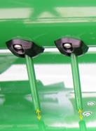
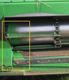
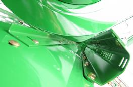
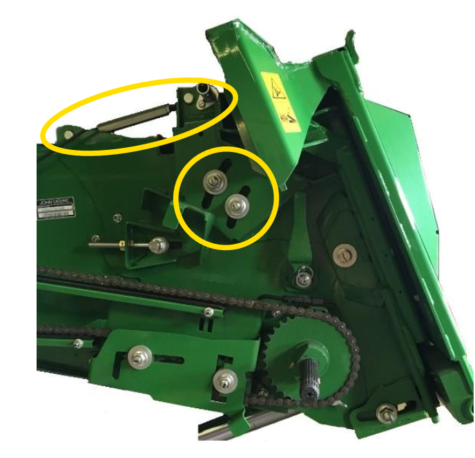

## Configuration de la plateforme

Il est primordial de suivre la procédure suivante afin de garantir un configuration optimale de voitre plateforme :

1. Réglez la **vis d’alimentation** et le **doigt de vis** sans fin pour la récolte de graminées.

    
 
1. Vérifiez la distance entre la **vis d’entrée** et les **racleurs**.

    

    * Réglez les **racleurs** selon les indications des **DTAC 76721** (600R) et des **DTAC 104058** (700X).

        

### Angle du convoyeur d’alimentation

L'angle du **convoyeur d'alimentation** doit être réglé à plat ou légèrement incliné vers l’avant afin de permettre le ramassage de la récolte sans pousser de terre.

* Vous pouvez ajuster l'angle à l'aide de la barre filetée.

   

Note: Consultez le livret d’entretien pour modifier le réglage d’autres unités. <!-- Dans l'idéal, il faudrait installer des extenstions markdown permettant l'utilisation de vraies notes directment imbriquées à la manière de notice notes DITA -->

### Longueur de table (700X)

La **longueur de table** de la 700X doit être réglée en fonction de la hauteur de la culture et de la hauteur des chaumes.
- Les **épis** doivent tomber entre les **spires** de la **vis d’alimentation**.