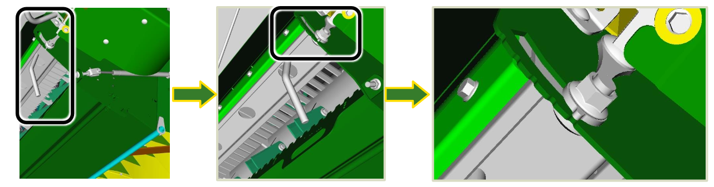

## Réglage des contre-couteaux

**Réglage continu, clé requise**

Note : Les rainures servent d'indicateur, les deux côtés dovent être identiques.

Pour la récolte de graminées, commencez par régler les **contre-couteaux** au plus bas puis augmentez les jusqu'à atteindre une qualité de broyage optimale.

Note : Des **contre-couteaux** placés trop haut n’offrent pas la meilleure qualité de broyage et utilisent
beaucoup de puissance.

 