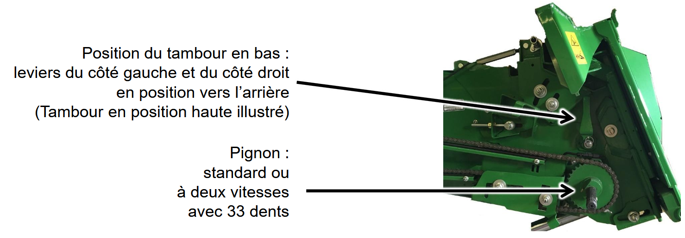

## Convoyeur d'alimentation

| Élément | Réglage |
|---------|---------|
| Position du tambour | En bas (poignée vers l’arrière) |
| Pignon | 33 dents |
| Racleur de l’arbre supérieur | Non |
| Portes perforées | Non |
| Convoyeur d’alimentation | Standard ou à deux vitesses avec 33 dents |

 <!-- Ajouter les flèches -->
