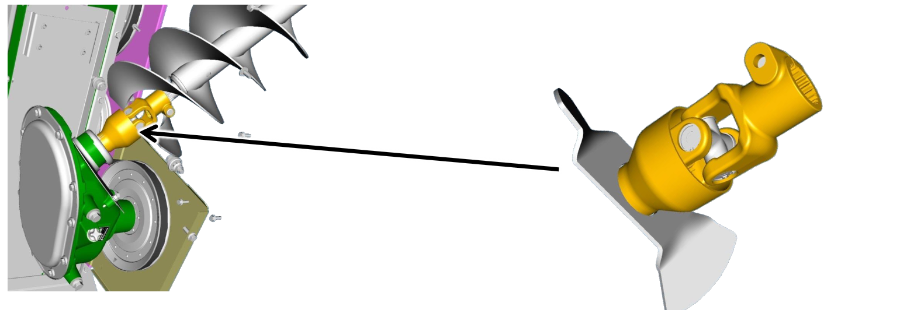

## Joint de cardan à ailette sur vis de remplissage de trémie à grain

Le **joint de cardan à ailettes** empêche l'accumulation de **graines humides**. Son usage est obligatoire lorsque l'on travaille avec des graminées.

* **Le joint de cardan à ailettes** est inclus:
    * Sur toutes les moissonneuses batteuses à vis de vidange à débit élevé 9,0 L (sortie d'usine).
    * Dans le kit optionnel graminées (sortie d'usine)

Note: Le **joint de cardan à ailettes** est aussi disponible en pièce de rechange.

