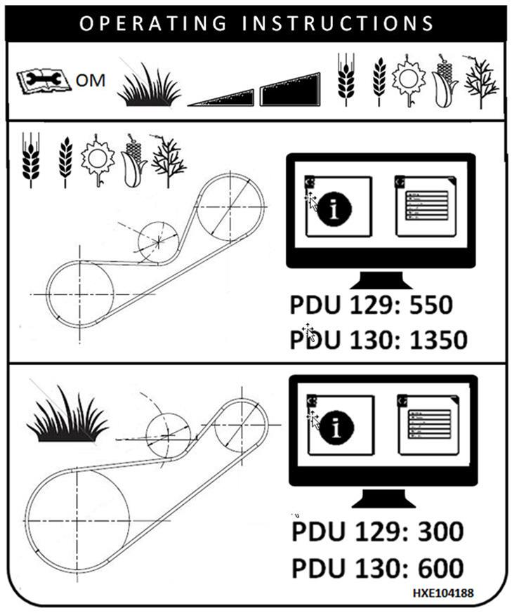
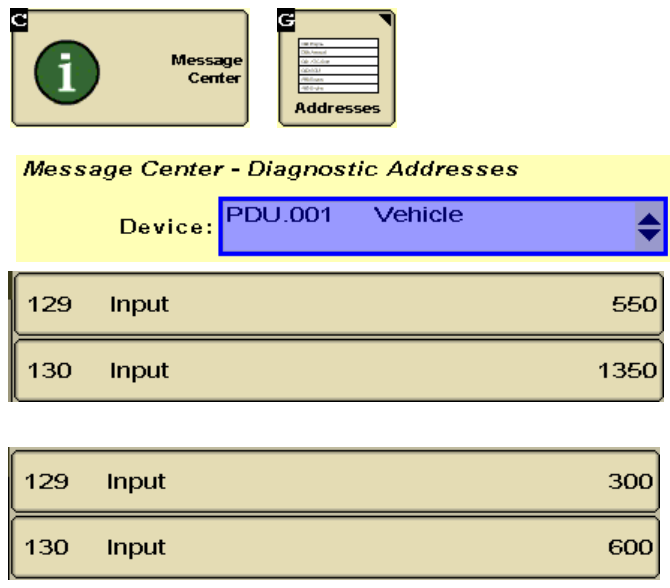

## Régime du ventilateur à deux plages

Configurez les adresses du diagnostic de la manière suivante:

**Haut** :

* PDU 129 : 550
* PDU 130 : 1350

**Bas** : 

* PDU 129 : 300
* PDU 130 : 600

Attention : Changer de plage sans modifier les adresses risque d'endommager le variateur de régime du ventilateur. Saisissez les réglages minimum et maximum respectifs pour la plage d'entraînement du ventilateur sélectionnée.

