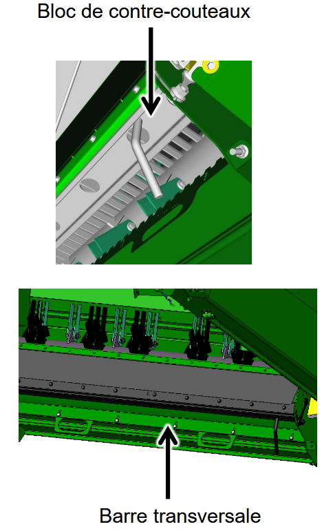

## Résidus

| Élément | Réglage |
|---------|---------|
| Régime du broyeur | Régime haut |
| Position des contre-couteaux | Engagé |
| Barre transversale | Si nécessaire |
| Vanne de vitesse de l’éparpilleur de menues pailles | Rapide |
| Déflecteur de rafles | Non |

 

 