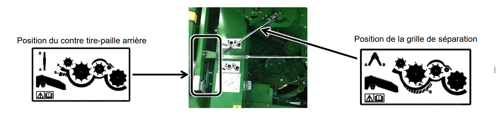
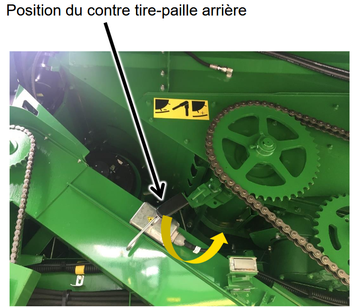

# Séparation

## Séparation – Série T

| Élément | Réglage |
|---------|---------|
| Position de la grille de séparation | Fermé |
| Position du contre tire-paille arrière | Fermé |
| Régime du séparateur | Rapide |
| Crêtes | Si nécessaire |
| Volets en caoutchouc aux extrémités des secoueurs | Non |

   

## Séparation – Série W

| Élément | Réglage |
|---------|---------|
| Position du contre tire-paille arrière | Fermé |
| Réduction du régime du tire-paille arrière | Non |
| Crêtes | Si nécessaire |
| Séparateur transversal à doigts | Si nécessaire |
| Volets en caoutchouc aux extrémités des secoueurs | Non |

   
