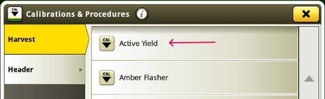
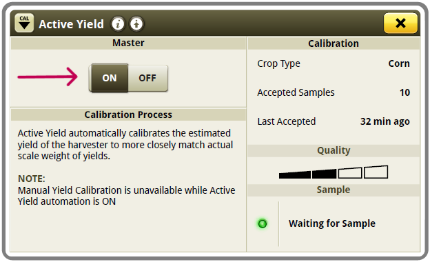

# Activation d'ActiveYield S700 - Console 4600

1. Appuyer sur  
2. Puis appuyer sur  pour accéder aux paramètres de calibrages.
3. Choisir **Active Yield**. 
    
   

4. Sélectionner **ON** pour activer le système. 
    
   

Les types de récoltes disponibles :

* Blé
* Orge
* Colza
* Maîs
* Soja