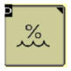
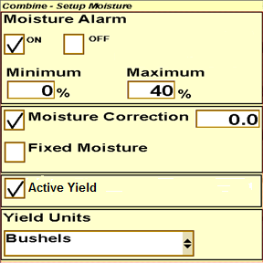

# Activation d'ActiveYield S600 - Console 2630

1. Appuyer sur  pour accéder aux paramètres de la moissonneuse-batteuse.
1. Selectrionner  pour accéder aux paramètres supplémentaires 
1. Appuyer sur  pour régler le pourcentage d'humidité.
1. Cocher la case **Active Yield** pour activer le system.

    
