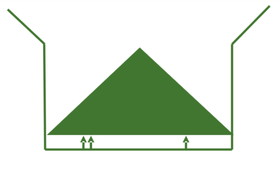

# Calcul du poids de la charge

Le taux de variation du poids dans la trémie à grain peut être estimé avec 3 cellules de charge plutôt que
par le pesage de l'ensemble du véhicule ou du contenu de la trémie à grain.

Le logiciel calcule la variation du poids des céréales au fil du temps, avec les données suivantes :
* Force totale sur les 3 cellules de charge, situées à des emplacements spécifiques dans la trémie lorsque le
niveau de grain augmente.
* Charge constante de la distance et de la hauteur de la pile de céréales dans la trémie à grain. (Pas de collines).
* Courbes de calibrage prisent à différents niveaux d'humidité par l'ingénierie lors de la phase de développement.

