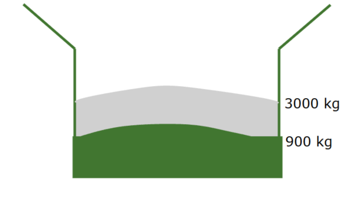

# Qu'est ce qu'une (échantillon) ActiveYield ?

Le système débute la collecte d'informations lorsque les cellules de charge indiquent que le poids du grain dans la trémie atteint 900 kg (2000 lb). Ensuite, il continue à mesurer jusqu'à ce que le poids atteigne 3000 kg (6600 lb). À ces seuils, le système peut ainsi suivre précisément l'évolution du poids du grain durant le remplissage, en évitant de se baser sur une trémie pleine ou un chargement complet, ce qui permet d'obtenir des mesures plus ciblées et pertinentes pour le contrôle du processus de stockage ou de chargement

La charge est enregistré tant que :
* La récolte est homogène, permettant un débit constant pendant la collecte de charges.
* Les conditions de terrain (inclinaisons) sont dans une limite de +/-4°.
* Aucune interruption du débit de céréales durant la collecte de charge (démarrage-arrêt, déchargement, décalage de la pile de
céréales dans la trémie, désenclenchement des organes de battage).

