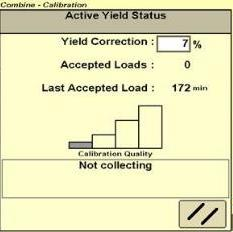
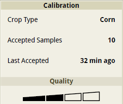
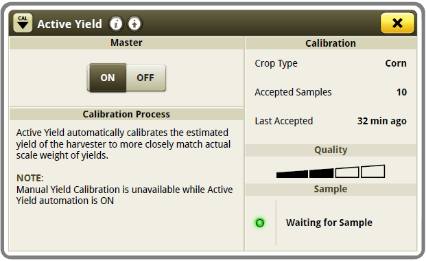
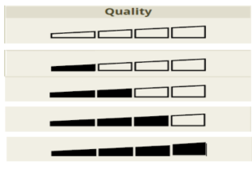

# Charges (échantillions) acceptées

L'indicateur de qualité du calibrage est indépendant du compteur de charges/échantillons
acceptés.

Le compteur de charges/d'échantillons "acceptés" compte chaque échantillon considéré
comme bon.

Cela aide l'opérateur à voir si ActiveYield accepte encore les charges dans les
conditions actuelles.

L'indicateur qualité reflette le nombre de charges acceptées que le système utilise (5-6
charges) et qui ont été accepté pour les points de données.

## Indication de la presentation des differentes interfaces 

**S600 - Console 2630**

**S700 - Console 4600**

