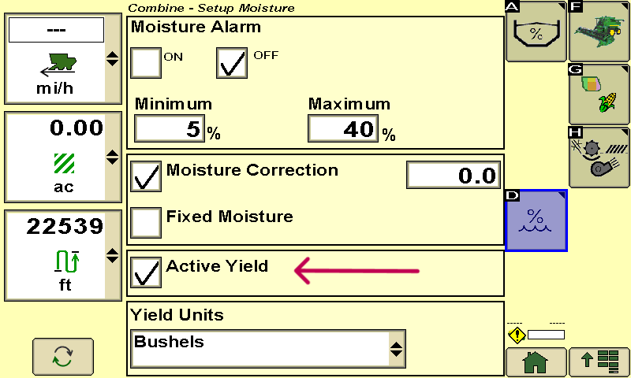
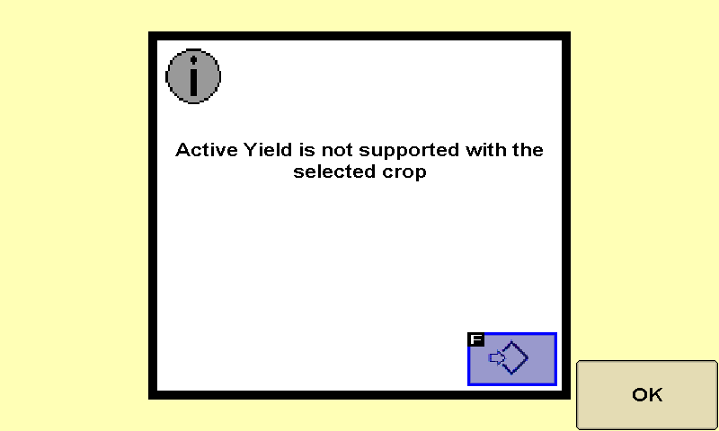
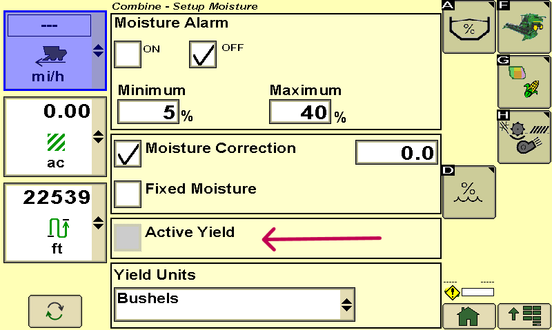

# Cultures non prises en charge – S600 - Console 2630

1. Cocher **Active Yield** pour activer le système lorsqu'une culture qui est prise en charge est sélectionnée.
    
    

2. Decocher **Active Yield** lorsqu'une culture qui n'est pas prise en charge a été sélectionnée.

    

    
