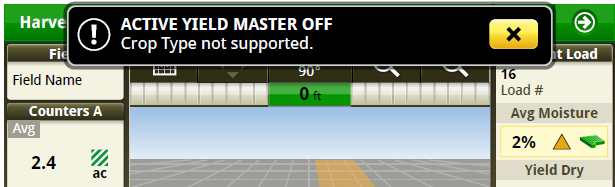

# Cultures non prises en charge - S700 - Console 4600

Si la culture est remplacée par une culture non prise en charge, le système est automatiquement arrêté.

Lors de la sélection d'un type de récolte pris en charge, un message affiche que ActiveYield est disponible.
